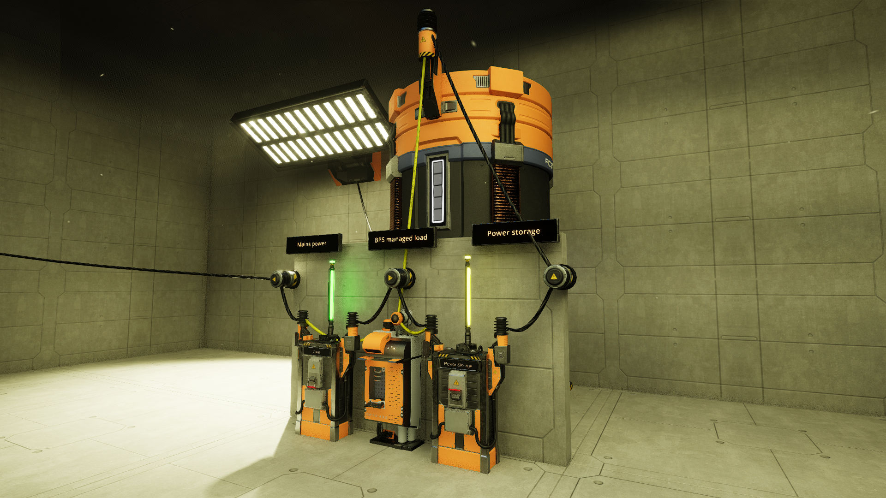
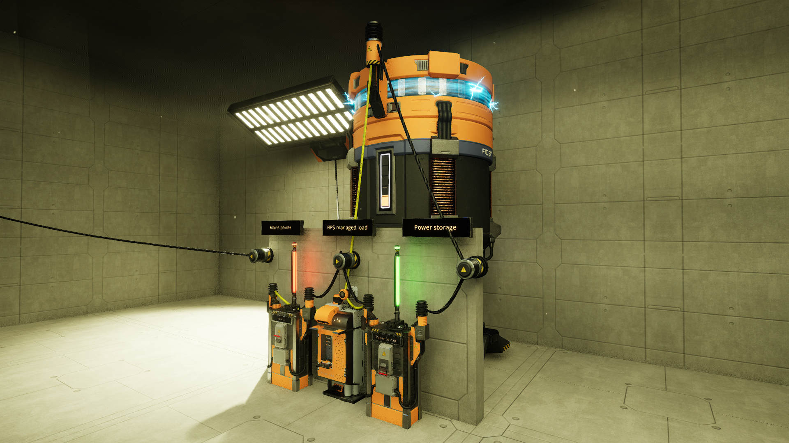

# The Backup Power Supply
The Ficsit Backup Power Supply manages backup power - sort of like a UPS but too slow to
guarantee uninterrupted power. Or is it?

## Setup
To use the Ficsit BPS, you will need one or more power storages, plus two power switches and of course a computer.
The switches must be hooked up as drawn below:

 mains power    load    power storage
      |           |           |
      |           |           |
      +-----/ ----+----/ -----+

          mains     power storage
         switch        switch

<figure>
    
    <figcaption>Example setup of the Ficsit BPS</figcaption>
</figure>

The mains switch must have the following nick: "BPS mainsSwitch"
The power storage switch must have the following nick: "BPS powerStorageSwitch"

The computer needs to have a network connection to both switches and a power storage.

## Operation and functioning
Once operational, the Ficsit Backup Power Supply will not need any attention from the employee.

The Ficsit BPS will monitor the grid and the connected power storage(s). When the overall load on the grid exceeds the production, it will disconnect itself from the grid and engage the power storage(s) so you can continue operating from the power storage(s) as long as there is any charge left in the power storage(s). Then, when the grid is balanced again, it will start charging the power storage(s).

## Considerations for designing your grid
To guarantee grid stability, Ficsit advises to have a minimum of one power storage connected
directly to the grid. This ensures there will be enough power available for the limited
amount of time it takes for your Backup Power Supply management system to flip its switches.

Please note that while the charge rate of a power storage is limited to 100 MW, its
discharge rate is unlimited. This means that for the maximum of five seconds it takes
for the BPS to provide backup power, a single power storage can supply as much
as 72,000 MW of power.
